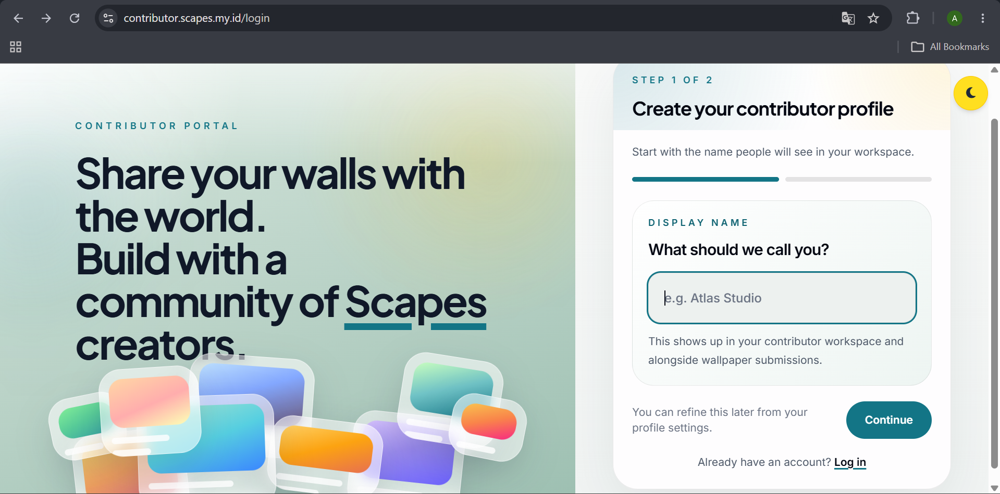
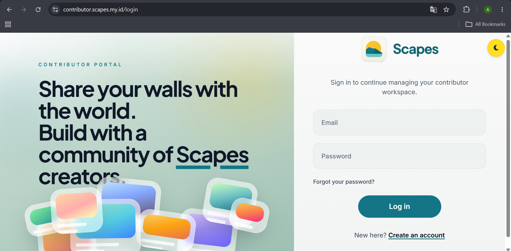
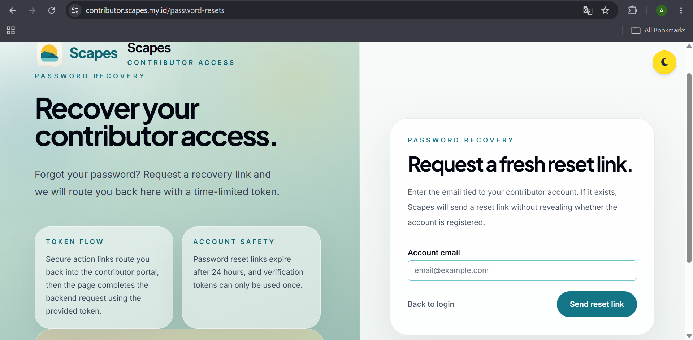
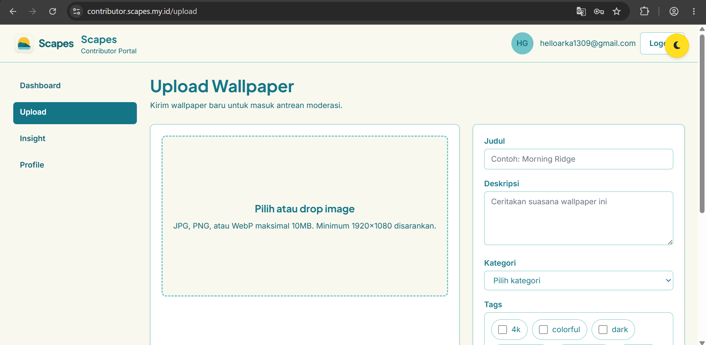
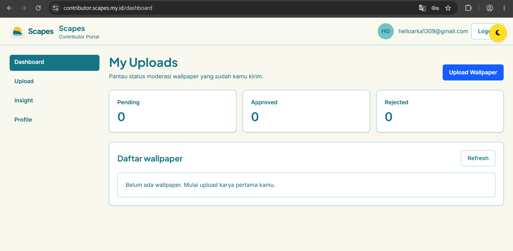
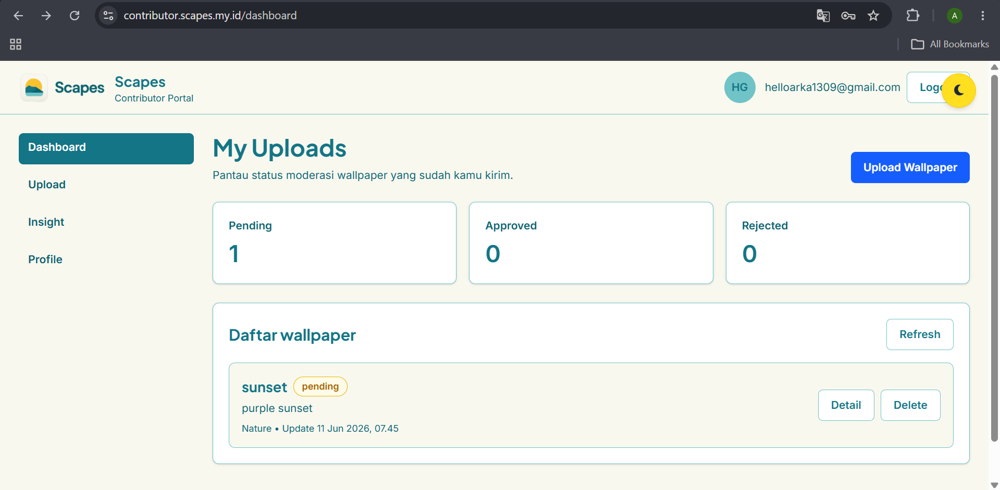
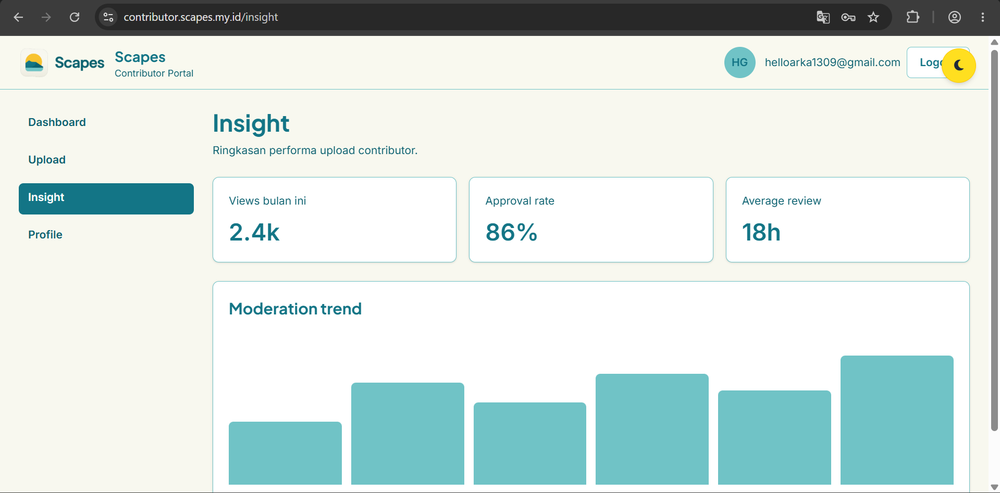
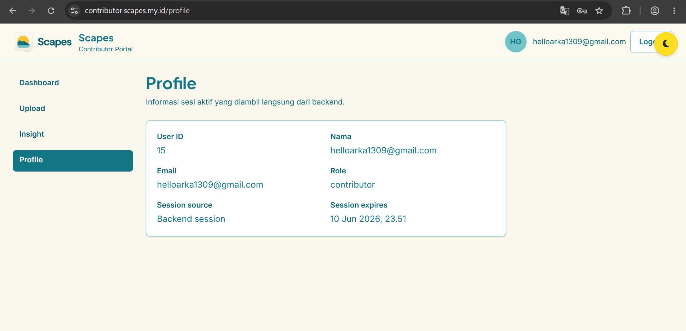
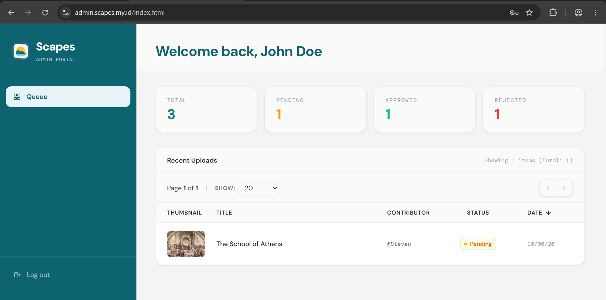
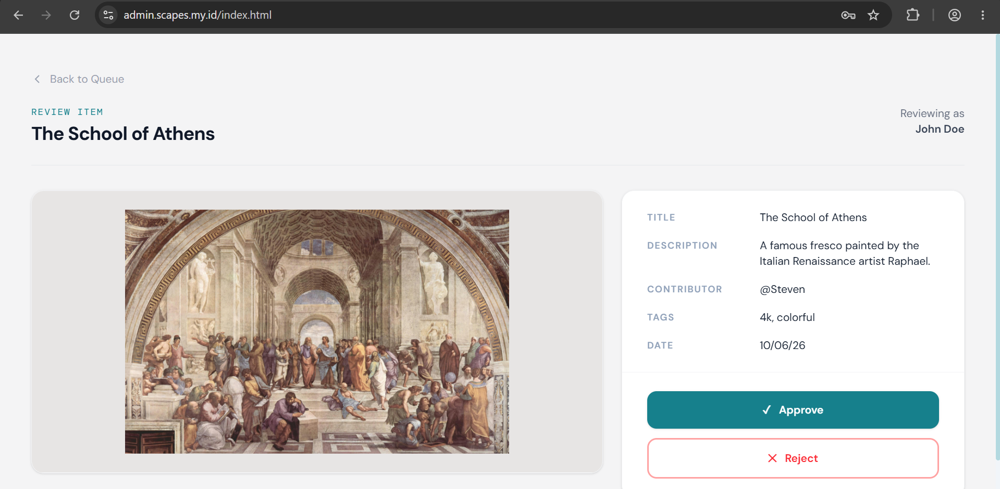

# Scapes

> Browse, download, and apply wallpapers directly from the internet — no browser needed. One click and it's on your desktop.

Scapes is a Kotlin Multiplatform wallpaper manager for Windows and Android. It also ships a contributor portal for uploading wallpapers and an admin portal for moderation.

## Changelog

| Repo | Latest release | Highlights |
|---|---|---|
| [scapes-app](https://github.com/Scapes-Wallpaper/scapes-app) | [v1.0.0](https://github.com/Scapes-Wallpaper/scapes-app/releases/tag/v1.0.0) | First stable Windows & Android release |

## Repositories

| Repo | Description |
|---|---|
| [scapes-app](https://github.com/Scapes-Wallpaper/scapes-app) | Kotlin Multiplatform app — Windows & Android |
| [scapes-backend](https://github.com/Scapes-Wallpaper/scapes-backend) | PHP REST API — auth, wallpapers, moderation |
| [scapes-db](https://github.com/Scapes-Wallpaper/scapes-db) | MySQL schema and migrations |
| [scapes-contributor](https://github.com/Scapes-Wallpaper/scapes-contributor) | Web portal for contributors |
| [scapes-admin](https://github.com/Scapes-Wallpaper/scapes-admin) | Web dashboard for admins |
| [scapes-landing](https://github.com/Scapes-Wallpaper/scapes-landing) | Public landing and download page |

## Features

**Contributor Portal**
1. Register and verify account via email
2. Login and logout
3. Reset password via email link
4. Upload wallpapers (JPG, PNG, WebP — max 10 MB, min 1920×1080)
5. Track moderation status per wallpaper (pending, approved, rejected)
6. Delete submitted wallpapers
7. Contributor insights — views and downloads per wallpaper
8. Profile page

**Admin Portal**
9. Dashboard — summary of pending, approved, and rejected wallpapers
10. Review and approve or reject wallpaper submissions with a reason

## Tech Stack

| Layer | Technology |
|---|---|
| Desktop & Mobile App | Kotlin Multiplatform, Compose Multiplatform |
| Contributor & Admin Web | HTML / JavaScript / Tailwind CSS / jQuery |
| Backend API | PHP 8.1, MySQL, Redis, JWT |
| Infrastructure | SMTP (email), PDO, PHPUnit, PHPStan |

## Live

| Portal | URL |
|---|---|
| User app | [scapes.my.id](https://scapes.my.id) |
| Contributor | [contributor.scapes.my.id](https://contributor.scapes.my.id) |
| Admin | [admin.scapes.my.id](https://admin.scapes.my.id) |

## Team

| Name | NIM | Role |
|---|---|---|
| Alifa Fitra Faiha | L0124036 | Support Developer & QA |
| Allia Nur Shafira | L0124037 | Front-End & Design |
| Bintang A'raaf Stevan Putra | L0124091 | Lead Developer |
| Allyssa Hatitya Pratiwi | L0124146 | Documentation & QA |

## Screenshots

| Feature | Preview |
|---|---|
| Contributor — Register |  |
| Contributor — Login |  |
| Contributor — Reset Password |  |
| Contributor — Upload Wallpaper |  |
| Contributor — Moderation Status |  |
| Contributor — Delete Wallpaper |  |
| Contributor — Insights |  |
| Contributor — Profile |  |
| Admin — Dashboard |  |
| Admin — Review Wallpaper |  |
